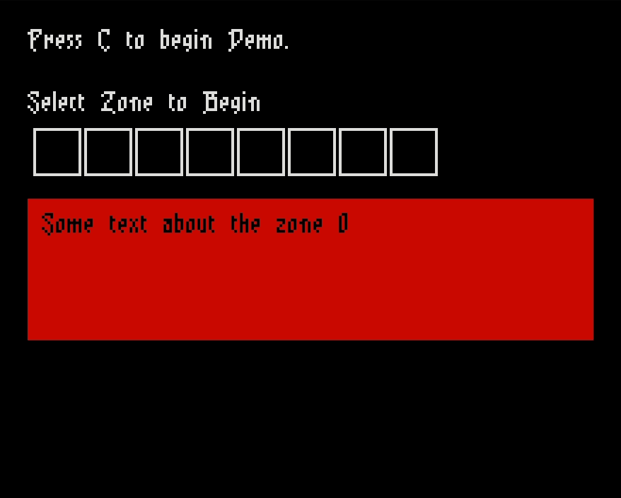

# VirusBuster
A wave shooter game for Pokitto

# Preview

Built with FemtoIDE

## TODO:

- Start screen.
- Room based, have to clear the room to advance to the next room (exiting to either of the four directions).
    - Each room is a "sector" on a Pokitto board, your program's task is to clear the viruses from each sector, restoring funcitonality to the Pokitto.
- Health (shield) meter. 
    - How much power is left connected to your program. As Viruses attack your program, you lose connection. 
- Different weapon types.
    - Viruses may drop upgrades, such as fragments of programs they destroyed. These will give your program extra powerful attacks for a limited time.
- SFX/Music
