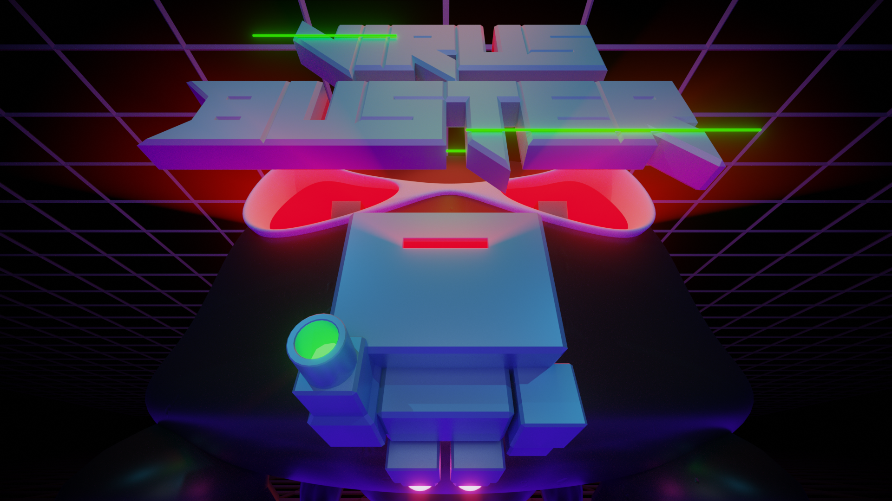

# VirusBuster
A wave shooter game for Pokitto

#### Banner created by [Pixelbath](https://github.com/pixelbath)
Built with [FemtoIDE](https://github.com/felipemanga/femtoide/)

## TODO:
- GameOver stage
- Better Title stage
- Story text for Micro and Mega Fragments (micro fragments are the currency, used for upgrades, Mega Fragments are for correcting the virus damage and "beating" the game. Collected from mega bosses)
- Update assets where needed. 

## Future Ideas Post Release:
- Different weapon types.
  - Viruses may drop upgrades, such as fragments of programs they destroyed. These will give your program extra powerful attacks for a limited time.
